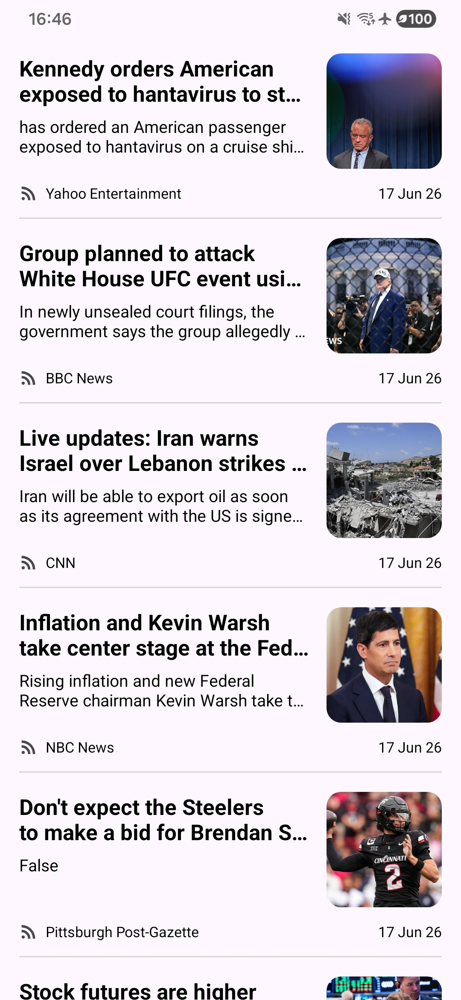

# News Feed

The app fetches US top headlines from NewsAPI, saves them in Room, and renders the cached list with RecyclerView.



## Running the project

1. Clone the repository and open it in Android Studio.
2. Create an API key at [newsapi.org](https://newsapi.org/).
3. Add the key to the root `local.properties` file:

   ```properties
   NEWS_API_KEY=your_api_key_here
   ```

4. Sync Gradle and run the `app` configuration on a device or emulator running Android 7.0 (API 24) or newer.


## How it is structured

The project uses a straightforward MVVM flow:

```text
NewsAPI
   ↓
Retrofit service
   ↓
NewsRepository
   ↓
Room database
   ↓
LiveData
   ↓
HeadlinesViewModel
   ↓
MainActivity
   ↓
RecyclerView
```

- `data/remote` contains the Retrofit service and response models.
- `data/mapper` converts API articles into Room entities.
- `data/local` contains the Room entity, DAO, and database.
- `NewsRepository` refreshes the API data and replaces the cached rows in local db.
- `HeadlinesViewModel` exposes cached articles plus loading and error state.
- `MainActivity` observes the ViewModel and switches between loading, content, and error views.
- `HeadlinesAdapter` binds each cached article to the XML row layout.


## Main libraries

- Android Views and XML layouts
- Lifecycle ViewModel and LiveData
- Retrofit with Gson
- Room
- RecyclerView
- Glide
